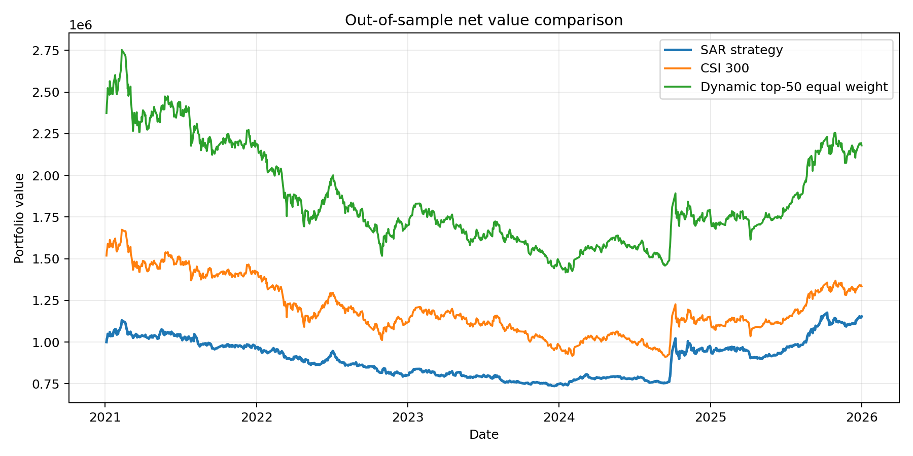
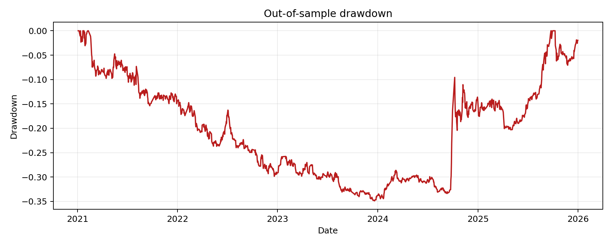
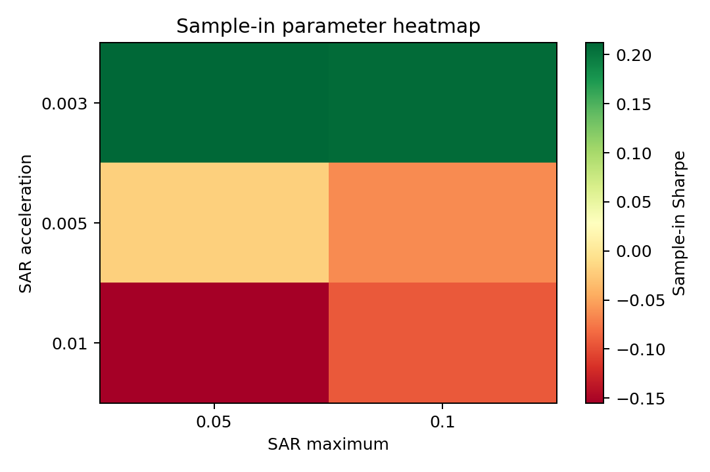
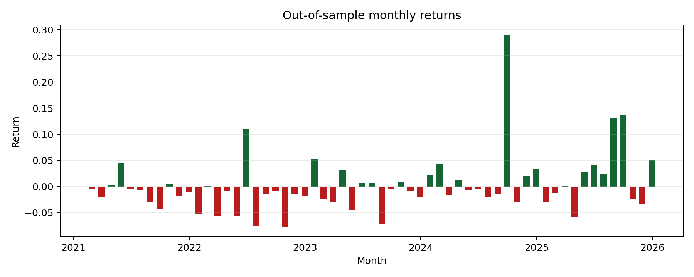
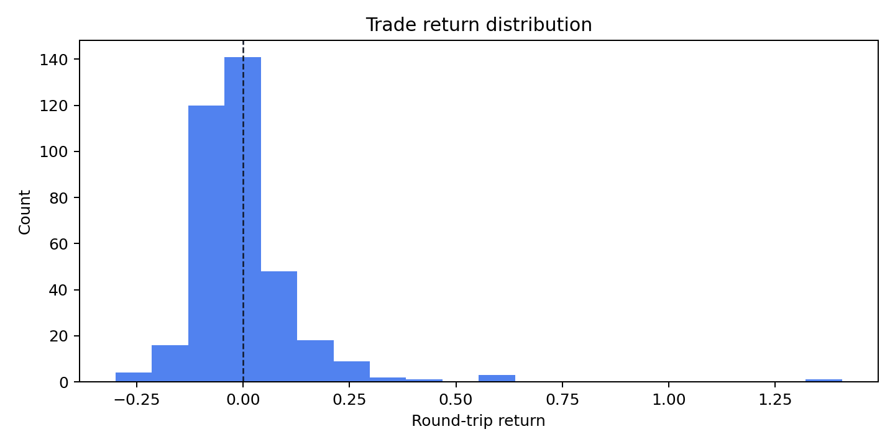

# SAR 抛物线趋势跟踪策略重做报告

## 项目摘要

本项目重做原本科 SAR 策略报告，重点展示数据获取、回测偏差修正、交易约束建模、样本内参数选择、样本外验证和结果解释能力。本报告使用 tinyshare/Tushare 接口下载的历史行情与指数成分数据生成。

## 原报告主要问题

- 样本外收益和夏普比率为硬编码结果，并非真实回测。
- 参数优化使用随机夏普，不能支持“最优参数稳定”的结论。
- 使用当前成分股回测历史，存在生存者偏差。
- 胜率混淆了正收益交易日比例和逐笔交易胜率。
- 未纳入 t+1 成交、交易成本、印花税、滑点、100 股约束和涨跌停限制。

## 数据与样本

- 区间：2016-01-01 至 2025-12-31。
- 股票池：每月沪深300历史权重前 50 只股票，并在每日使用最近可得成分。
- 样本内：2016-2020；样本外：2021-2025。
- 基准：沪深300价格指数、动态前50等权组合。

- 数据覆盖：历史前50联合股票 142 只，成功缓存 140 只，缺失 2 只；缺失列表：601127.SH, 601336.SH。

## 策略规则

买入候选要求 `close_adj > SAR`、`volume_ratio` 高于阈值且 RSI 低于上限；卖出条件包括价格跌破 SAR、RSI 超买、止损、止盈或离开候选池。所有信号在 t 日收盘后确认，交易在 t+1 日开盘执行。

本版策略不允许通过长期空仓来制造超额收益。样本内参数选择先要求平均股票仓位、平均持仓数量和低仓位天数比例满足约束，再要求样本内收益、超额收益和最大回撤达到训练底线。过线后，优化器优先选择更分散的组合，并对样本内超额收益设置打分上限，避免单纯追逐训练集最高超额。

## 参数选择

样本内最优参数：

| 参数 | 数值 |
| --- | ---: |
| SAR acceleration | 0.0030 |
| SAR maximum | 0.0500 |
| Volume threshold | 0.5000 |
| RSI ceiling | 100.00 |
| Max positions | 50 |
| Rebalance interval | 20 |
| Stop loss | 30.00% |
| Take profit | 不主动止盈 |

## 样本外核心结果

| 指标 | 样本内 | 样本外 |
| --- | ---: | ---: |
| 总收益率 | 63.12% | 11.81% |
| 年化收益率 | 10.65% | 2.35% |
| 年化波动率 | 18.08% | 18.33% |
| 夏普比率 | 0.42 | -0.04 |
| 最大回撤 | -29.33% | -45.14% |
| 沪深300累计收益率 | 50.22% | -12.11% |
| 累计超额收益率 | 12.90% | 23.91% |
| 平均股票仓位 | 75.35% | 75.97% |
| 低仓位天数比例 | 7.80% | 1.65% |
| 平均持仓数量 | 18.37 | 16.14 |
| 总换手率 | 50.51 | 58.63 |
| 逐笔交易胜率 | 41.12% | 37.74% |
| 交易股票数 | 96 | 98 |
| 单一股票成交额占比上限 | 4.38% | 3.25% |

样本外累计收益对比：策略 11.81%，沪深300 -12.11%，动态前50等权组合 -8.19%。本版策略在扣除交易成本后取得正的累计超额收益，但该结果仍属于课程级历史回测，不等同于可实盘收益承诺。

## 图表

## 审计附件

报告目录下的 `audit/` 提供可复核附件：

| 文件 | 用途 |
| --- | --- |
| `trade_ledger_sample_out.csv` | 样本外全部成交与未成交阻断记录，附信号日 SAR、RSI、成交量比例和推断触发原因 |
| `round_trip_trades_sample_out.csv` | 样本外买入与卖出配对后的完整交易回合 |
| `portfolio_sample_out.csv` | 样本外每日组合净值、现金、持仓数量和基准净值 |
| `optimization_results_sample_in.csv` | 样本内全部参数组合真实回测结果 |
| `market_data_used.csv.gz` | 样本外回测使用的行情、复权字段和信号字段 |
| `source_data_inventory.csv` | 本地缓存数据文件行数、日期范围和 SHA-256 |
| `raw_snapshot_manifest.csv` | 原始 tinyshare/Tushare 快照清单，不包含 token |
| `audit_manifest.csv` | 审计附件文件大小、生成时间和 SHA-256 |

这些附件用于复核报告核心数字和样本外交易，不提交 `.env`、token 或原始大体量 API 响应。

## 结论与边界

本项目不能被表述为“成熟稳定盈利策略”或“可直接实盘部署系统”。更准确的表述是：使用 Python 完成了 A 股日频技术指标策略的数据获取、动态股票池构建、交易约束回测、样本内外验证和绩效分析。策略结果应作为课程级研究练习与实习能力展示，而非投资建议。

还需要说明：本次重做过程根据原报告问题和中间回测诊断调整了规则，因此 2021-2025 对最终代码是样本外区间，但不应包装成完全盲测。若要进一步提高可信度，应使用更新数据或额外保留区间进行二次验证。

## 简历可表述

可写：使用 Python 与 tinyshare/Tushare 构建 A 股 SAR 趋势跟踪回测框架，完成历史成分股股票池、复权行情处理、t+1 成交、交易成本、样本内参数选择、样本外绩效评估和报告生成。

不建议写：独立开发稳定盈利量化策略、策略显著长期跑赢沪深300、完成可实盘交易系统。
